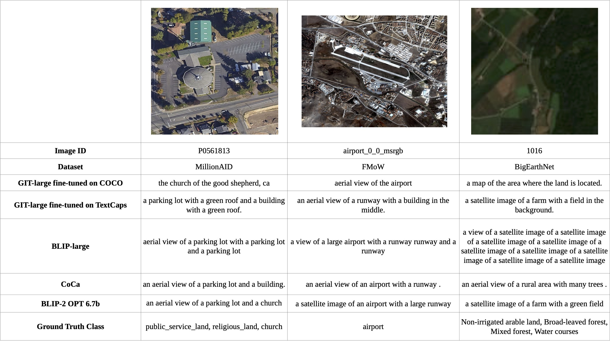
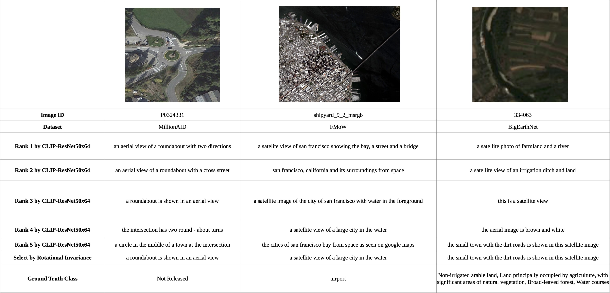

# RS5M

**Official Repo for RS5M Dataset**

Pre-trained Vision-Language Foundation Models utilizing extensive image-text paired data have demonstrated unprecedented image-text association capabilities, achieving remarkable results across various downstream tasks. A critical challenge is how to make use of existing large-scale pre-trained VLMs, which are trained on common objects, to perform the domain-specific transfer for accomplishing domain-related downstream tasks. In this paper, we propose a new framework that includes the Domain Foundation Model (DFM), bridging the gap between the general foundation model (GFM) and domain-specific downstream tasks. Moreover, we present an image-text paired dataset in the field of remote sensing (RS), RS5M, which has 5 million remote sensing images with English descriptions. The dataset is obtained from filtering publicly available image-text paired datasets and captioning label-only RS datasets with pre-trained models. These constitute the first large-scale RS image-text paired dataset. Additionally, we tried several Parameter-Efficient Tuning methods with Vision-Language Models on RS5M as the baseline for the DFM. Experimental results show that our proposed datasets are highly effective for various tasks, improving upon the baseline by $\sim$ 16 % in zero-shot classification tasks, and obtain good results in both Vision-Language Retrieval and Semantic Localization tasks.


## Statistics
### PUB11 Subset

| Name               | Amount |   After Keyword Filtering |   Download Image|  Invalid Image (Removed) |   Duplicate Image (Removed)|  Outlier images (Removed by VLM and RS Detector)|  Remain |
|:------------------:|:------:|:-------------------------:|:----------:|:------------------------:|:---------------------:|:------------------------------:|:--------:|
| LAION2B            | 2.3B   | 1,980,978   | 1,737,584   |             102          |        343,017        |          333,686               |1,060,779 |
| COYO700M           | 746M   | 680,089     | 566,076     |     28                   |245,650                |94,329                          | 226,069  |
| LAIONCOCO          | 662M   | 3,014,283   | 2,549,738   |       80                 |417,689                |527,941                         | 1,604,028|
| LAION400M          | 413M   | 286,102     | 241,324     |25                        |141,658                |23,860                          | 75,781    |
| WIT                | 37 M   | 98,540      | 93,754      |0                         |74,081                 |9,299                           | 10,374    |
| YFCC15M            | 15M    | 27,166      | 25,020      |0                         |265                    |15,126                          | 9,629     |
| CC12M              | 12M    | 18,892      | 16,234      | 0                        |1,870                  |4,330                           |10,034    |
| Redcaps            | 12M    | 2,842       | 2,686       | 0                        |228                    |972                             |1,486     |
| CC3M               | 3.3M   | 12,563      | 11,718      | 1                        |328                    |1,817                           |9,572     |
| SBU                | 1M     | 102         | 91          |0                         |4                      |36                              |51        |
| VG                 | 0.1M   | 26          | 26          | 0                        |0                      |20                              |6         |
| Total              | 4.2B   | 6,121,583   | 5,244,251   | 236                        |1,224,790              |1,011,416                       |3,007,809 |


### RS3 Subset

| Name               | Amount | Original Split | Has Class label |
|:------------------:|:------:|:--------------:|:---------------:|
|FMoW|727,144|Train|Yes|
|BigEarthNet|344,385|Train|Yes|
|MillionAID|990,848|Test|No|
|Total|2,062,377|-|-|


## Access
We use Aliyun's OSS ([Object Storage Service](https://www.alibabacloud.com/help/en/object-storage-service/latest/ossutil-overview) to host our dataset (500GB in total).

Bucket name can be found in openreview's Dataset Url.

The dataset can be downloaded with command:

```bash
ossutil sync oss://xxxx/ /your/local/dir/
```


## Experiment Result

### Zero-shot Classification

### Vision-Language Retrieval

### Semantic Localization


## Dataset Loading Tool
We use [webdataset](https://webdataset.github.io/webdataset/) to load the RS5M dataset. The tar file can be loaded as follow:

```python
from PIL import Image
import io
import torchvision.transforms as transforms
import webdataset as wds
from torch.utils.data import DataLoader

def decode_img_text(k, v):
    if "caption" in k:
        value = v.decode('ascii', 'replace')
        return value
    elif "image" in k:
        value = Image.open(io.BytesIO(v)).convert("RGB")
        return value

def pretrain_dataloader(tgt_path, bs, num_worker):
    def rs_transform():
        preproc = transforms.Compose([transforms.ToTensor()])
        return preproc

    def text_transform(x):
        return x

    img_transform = rs_transform()
    raw_dataset = wds.WebDataset(tgt_path)
    dataset = (
        raw_dataset
            .shuffle(1000)
            .decode(decode_img_text)
            .to_tuple("input.image", "input.caption")
            .map_tuple(img_transform, text_transform)
    )
    dataloader = DataLoader(dataset, batch_size=bs, num_workers=num_worker)
    return dataloader

dataloader = pretrain_dataloader("dataset/train.tar", 100, 32)
for index, (image, caption) in enumerate(dataloader):
    print(index, image.shape, caption)
```

## Inference
```bash
python src/downstream_main.py --batch_size 100 --num_gpu 1 --num_cpu 16 --downstream_dataset_root ../datasets/downstream_task_dataset  --downstream_config_path ../configs/downstream_adapter-unipelt_ViT-B-32-quickgelu_EuroSAT.yaml
```

## Demo: Caption with VLMs (RS3)

### Caption with huggingface [comparing-captioning-models](https://huggingface.co/spaces/nielsr/comparing-captioning-models)


### Caption with BLIP2 opt6.7



